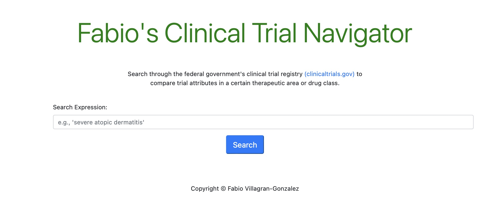
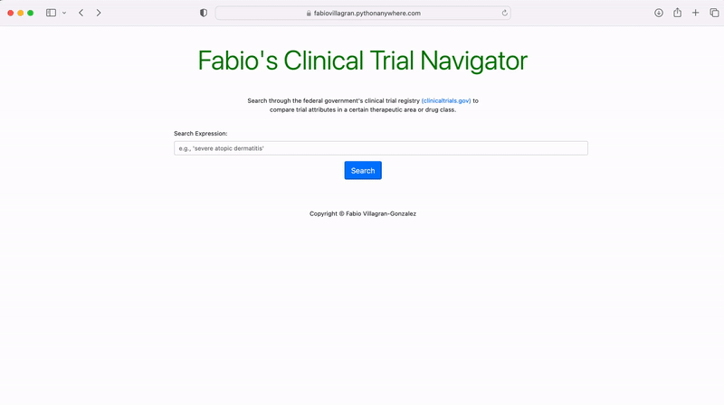
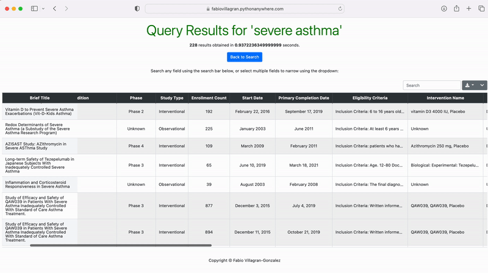

# Clinical Trial Navigator

This is a web-based tool built with Python/Django that takes a search expression as input and queries the [Clinical Trial National database](https://clinicaltrials.gov), returning a clean table of results that contains key clinical trial information. Returned fields include NCTID number, trial drug, comparator, inclusion criteria, clinical endpoints, and other pertinent data points.

Link:  https://fabiovillagran.pythonanywhere.com

## How to Use

First, enter a term or expression that you wish to search within the government's clinical trials registry.

Your results will be returned in a clean table containing key trial attributes/information.  You can search and/or filter any column of interest, and can expand or collapse all clinical outcome measures for a given trial to observe all clinical outcomes and compare between  trials. 

Result sets can also be downloaded as a CSV, Excel workbook, or PDF file.

